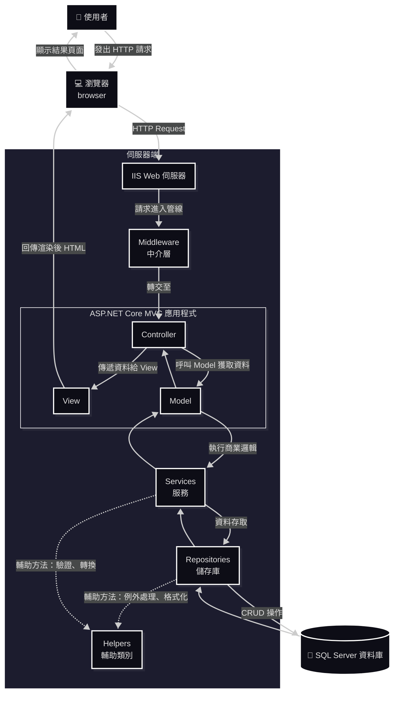
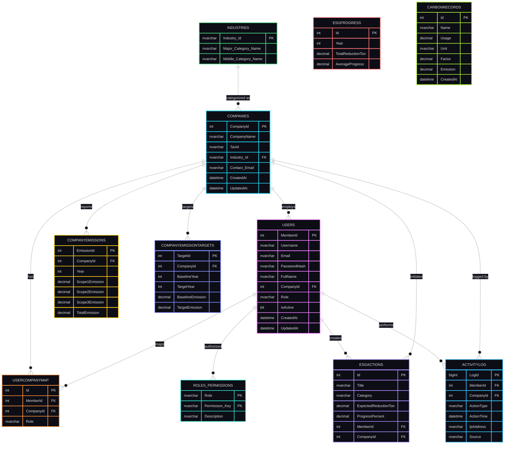

  

  

# 🌿 Django RBACProject

> 以 Python Django 架構開發的 RBACProject 管理平台，協助企業追蹤、分析與管理公司數據。

---

## 🧭 專案資訊 (Project Information)
| 分類 | 說明 |
|------|------|
| **專案名稱** | Django RBACProject|
| **開發框架** | Python Django |
| **資料庫** | SQL Server / PythonAnywher |
| **主要功能** | 帳戶管理、碳排追蹤、目標設定、活動紀錄 |
| **開發者** | 徐秉群 (Allen Hsu) |
| **版本** | v2.0.0 |
| 線上 Demo | [https://jinnsun2024.pythonanywhere.com/](https://jinnsun2024.pythonanywhere.com/) |

---

## 📚 目錄 (Table of Contents)
- [專案簡介](#專案簡介)
- [專案導覽](#專案導覽)
- [專案目標](#專案目標)
- [系統架構](#系統架構)
- [核心模組](#核心模組)
- [系統安全設計](#系統安全設計)
- [資料庫設計（SQL Server）](#資料庫設計)
- [專案亮點](#專案亮點)
- [後續發展建議](#後續發展建議)
- [License](#License)
- [報告與文件](#報告與文件)
- [聯絡資訊](#聯絡資訊)

---

## 📖 專案簡介  

**CarbonProject** 是一款面向企業的碳排放與 ESG 管理系統。系統以可擴充的多層式架構設計（Controller / Service / Repository / Model），強調安全性與可維護性。  
它能協助企業：  
- 🔍 **盤查碳足跡**：自動計算與匯總碳排放數據  
- 📊 **視覺化分析**：呈現碳排放趨勢與熱點  
- 📑 **生成 ESG 報告**：ESG 行動管理與報表匯出（含 PDF）。 
- 👥 **追蹤行動方案**：監控 ESG 進度與目標達成率  

本系統以 **ASP.NET Core MVC 8.0** 為核心，整合 **SQL Server、iTextSharp PDF、Chart.js** 等技術，  
並特別強調 **使用者體驗 (UX)** 與 **資安防護 (Security)**。  

<a href="#Table_of_Contents">📑 目錄</a>
  

---

## 🧭 專案導覽
- [第一章《角色權限系統》](docs/01_RolePermissionSystem.md)
- [第二章《使用者認證與註冊系統》](docs/02_UserAuthAndRegister.md)
- [第三章《JWT 記住我功能》](docs/03_JWTRememberMe.md)
- [第四章《Claims-based 認證流程》(Claims-based Authentication Flow)](docs/04_ClaimsBasedAuthenticationFlow.md)

---

## 🧭 專案目標

- 🧩 建立完整的 **碳排放與 ESG 管理解決方案**
- 🎯 提供簡潔直觀的 **使用者介面**
- 🛡️ 強化 **企業資料安全、資料稽核與可追溯的活動紀錄**
- 🌱 協助企業達成 **碳排放量降低 30%**
- ‍🔧 支援雲端部署與擴展（IIS / Azure）

<a href="#Table_of_Contents">📑 目錄</a>
  

---

## 🏗️ 系統架構

**技術堆疊（Tech Stack）**
| 類別 | 技術 |
|------|------|
| Framework | ASP.NET Core MVC 8.0 |
| 語言 Language | C# |
| 資料庫 Database | SQL Server / Azure SQL |
| ORM | Entity Framework Core |
| PDF Engine | iTextSharp |
| 前端 | Razor Views, Bootstrap, Chart.js |
| 驗證服務 Authentication | Claims-Based + Session + JWT |
| Logging | ActivityLog 模組 |
| 部署 | IIS / Azure Web App |

**系統流程（簡要示意）**

<a href="#Table_of_Contents">📑 目錄</a>
  

---

## 💡 核心模組  

| 模組 | 功能描述 |
|------|-----------|
| 會員登入 / 註冊 | 支援公司與成員帳號，採 Session 驗證 |
| 碳排放紀錄 | 可記錄年度排放量與目標值 |
| 視覺化圖表 | 使用 Chart.js 呈現排放趨勢與比例 |
| 活動紀錄 | 追蹤登入、更新與資料變更 |
| 管理者後台 | 查看全公司資料與平均排放狀況 |

- **會員與權限管理**（Admin / Company / Staff / Viewer）  
- **碳排放記錄與目標**（CompanyEmissions、CompanyEmissionTargets）  
- **ESG 行動管理**（ESGActions、ESGProgress）  
- **活動日誌**（ActivityLog）：操作稽核、IP / User-Agent / CorrelationId  
- **公告系統**（Company 層級）  
- **報表匯出**：PDF（iTextSharp）、Chart.js 視覺化  

<a href="#Table_of_Contents">📑 目錄</a>
  

---

## 🔐 系統安全設計

- Claims-based 認證 + Session + JWT（可選「記住我」功能）  
- 密碼使用 BCrypt 加密（BCrypt.Net-Next）  
- 帳號鎖定機制：連續失敗 5 次鎖定，30 分鐘自動解鎖  
- CSRF 防護（ValidateAntiForgeryToken）與安全 Cookie（HttpOnly / Secure / SameSite）  
- 角色/權限表（Roles_Permissions）實作 RBAC  

<a href="#Table_of_Contents">📑 目錄</a>
  

---

## 📀 資料庫設計（SQL Server）  

簡化 ER 圖（主要表格與關聯）：  

<a href="#Table_of_Contents">📑 目錄</a>
  

---

## 🌟 專案亮點

  本專案採用 **ASP.NET Core MVC 架構**與**多層式設計**原則，結合現代化的技術實踐，打造出高效能、可維護、可擴充的企業級碳管理系統。  
  The project is built with ASP.NET Core MVC architecture and modern design principles, focusing on performance, scalability, and maintainability for enterprise-level carbon management.  
- 採用 多層式架構（Controller / Service / Repository）提高可維護性  
- 使用 EF Core 簡化 ORM 與 Migration 管理  
- ActivityLog 提供完整操作稽核與追蹤能力  
- 支援 PDF 匯出（中文字體處理）與 Chart.js 視覺化報表  
- 設計兼顧安全性（BCrypt、CSRF、HttpOnly Cookie、帳號鎖定）  

### 🧩 架構設計 Architecture Design

- **ASP.NET Core MVC Framework**  
  採用跨平台、高效能的 ASP.NET Core，具備良好的可維護性與可擴展性。  
  Built on ASP.NET Core, a high-performance and cross-platform web framework for scalable and maintainable applications.

- **Layered Architecture (多層式架構)**  
  將應用分為 Controller、Service、Repository、Model 等層，確保職責分離。  
  Implements a layered architecture to ensure clear separation of concerns between components.

### 💾 資料存取層 Data Access Layer

- **Entity Framework Core (EF Core)**  
  使用 EF Core 進行 ORM 操作，簡化資料庫 CRUD 流程，並支援 LINQ 查詢與 Migration 管理。  
  Utilizes EF Core for ORM-based data access, simplifying CRUD operations and supporting LINQ and database migrations.

- **Repository Pattern**  
  將資料存取邏輯封裝於 Repository，實現資料層與業務邏輯層分離。  
  Encapsulates data access logic within repositories for better abstraction and maintainability.

### 🧠 系統設計 System Design

- **Dependency Injection (依賴注入)**  
  使用 ASP.NET Core 內建的 DI 容器，降低耦合度並提升可測試性。  
  Employs built-in dependency injection to enhance testability and reduce coupling between components.

- **ViewModel Pattern**  
  將資料由 Controller 傳遞至 View，確保資料結構與顯示邏輯分離。  
  Uses ViewModel to transfer data between Controller and View, improving front-end flexibility.

- **Session 狀態管理 (Session Management)**  
  透過 Session 儲存登入使用者資訊（如 MemberId, CompanyId），維持使用者狀態。  
  Manages user sessions to persist authentication and contextual data between requests.

### 📊 系統紀錄與追蹤 System Logging & Auditing

- **ActivityLog 使用者活動紀錄**  
  將使用者操作記錄於資料表中，包括登入、登出、修改、刪除等動作，方便後續稽核與行為分析。  
  Records all user actions such as login, logout, and updates into the ActivityLog table for audit and analysis.

- **IP & User-Agent 追蹤**  
  每筆活動紀錄包含 IP 位址與使用者代理資訊，以提升安全性與可追溯性。  
  Each activity entry stores IP address and User-Agent for enhanced security and traceability.

### 🔐 安全性設計 Security Features

- **角色與權限管理 (Role-Based Access Control)**  
  使用 Roles_Permissions 表實作角色權限控制，確保不同身分的使用者僅能存取對應功能。  
  Implements RBAC (Role-Based Access Control) using the Roles_Permissions table.

- **帳號安全機制 (Account Protection)**  
  支援電子郵件驗證、登入失敗次數限制與狀態鎖定，保障系統安全。  
  Supports email confirmation, login attempt limits, and account locking for enhanced security.

### 🌱 永續發展模組 Sustainability Modules

- **CompanyEmissions 與 ESGActions 模組整合**  
  支援公司碳排放紀錄、ESG 行動追蹤與減碳成效統計。  
  Integrates company emission data with ESG actions for emission tracking and sustainability analysis.

- **自動計算排放總量 (TotalEmission)**  
  使用 SQL 計算欄位自動匯總 Scope 1, 2, 3 排放量，減少重複計算。  
  Uses computed SQL columns to automatically aggregate Scope 1–3 emission data.

### 🧰 技術總覽 Tech Stack  
| 分類 | 技術 |
|------|-----------|
| 前端 (Frontend) | Razor Views, HTML5, Bootstrap |
| 後端 (Backend) | ASP.NET Core MVC, C# |
| ORM | Entity Framework Core |
| 資料庫 (Database) | Microsoft Azure SQL Server |
| 紀錄與稽核 | ActivityLog Table, Middleware Logging |
| 架構設計 | Repository Pattern, ViewModel, DI |
| 安全性 | Session, Role-Based Access, Validation |

<a href="#Table_of_Contents">📑 目錄</a>
  

---

## ⌨️ 後續發展建議 

- **加入身份驗證和授權：**  
  目前專案沒有實現完整的身份驗證和授權功能，建議使用 ASP.NET Core Identity 來實現更安全的身份驗證和授權。  
- **使用更現代化的前端框架：**  
  目前專案可能使用 jQuery 或 Bootstrap 等前端框架，建議使用更現代化的前端框架，例如 React、Vue.js 或 Angular，來提高使用者體驗。  
- **使用更強大的日誌框架：**  
  目前專案可能使用 ILogger 介面來記錄日誌，建議使用更強大的日誌框架，例如 Serilog 或 NLog，來提供更豐富的日誌功能。  
- **加入單元測試和整合測試：**  
  目前專案沒有提供測試程式碼，建議加入單元測試和整合測試，以確保程式碼的品質和穩定性。  
- **使用更安全的 Session 管理：**  
  目前專案使用 Session 來管理使用者狀態，建議使用更安全的 Session 管理方式，例如使用 Redis 或 SQL Server 來儲存 Session 資料。  
- **優化資料庫效能：**  
  建議對資料庫進行效能優化，例如建立索引、優化查詢語句等，以提高應用程式的效能。  

<a href="#Table_of_Contents">📑 目錄</a>
  

---

## 📄 授權條款 (License)

此專案僅供學術與內部開發測試用途，未經授權請勿用於商業目的。  

Copyright (c) 2025 Allen Hsu

Permission is hereby granted to use, copy, and modify this software 
for **academic, research, or educational purposes only**, provided 
that proper credit is given to the original author.

Commercial use, redistribution, or modification for profit is 
strictly prohibited without explicit written permission.

THE SOFTWARE IS PROVIDED "AS IS", WITHOUT WARRANTY OF ANY KIND.  

<a href="#Table_of_Contents">📑 目錄</a>
  

---

## 📁 報告與文件  

詳細**功能說明**、**資料庫腳本**與**長篇報告**放在  
docs/  
Report/  
database/  
> [💒 返回頁首](#README)  
  [📑 目錄](#Table_of_Contents)  

---

## ✉️ 聯絡資訊  

> 開發者：徐秉群 (Allen Hsu)  
  Email：mituteruhsu@gmail.com  
